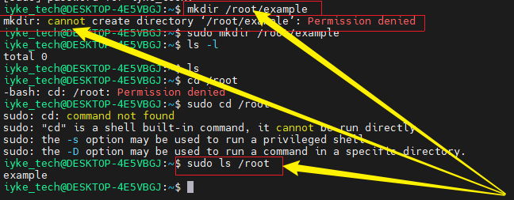
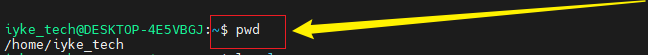
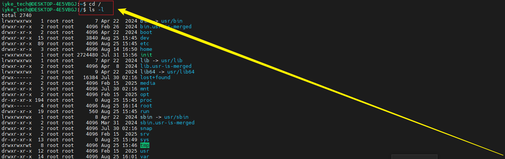
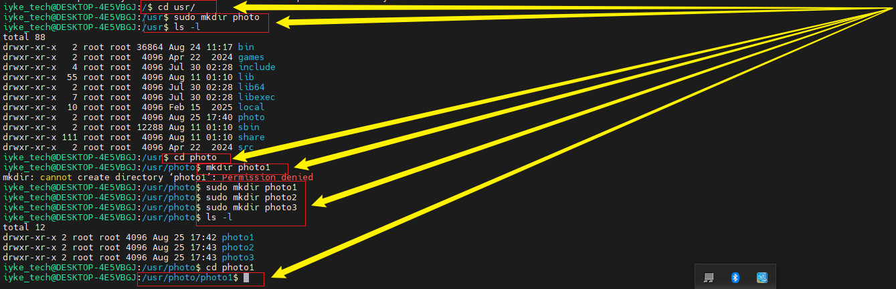
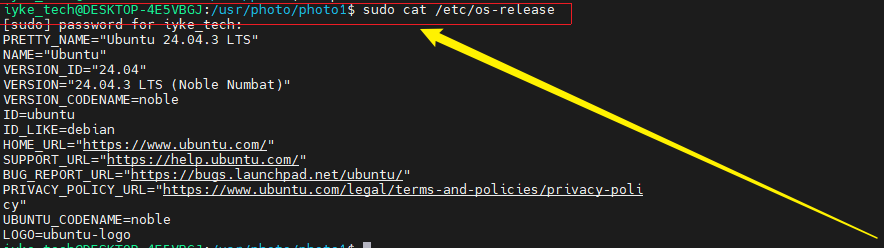

# Linux-File-System-Navigation-and-Management
In this project, I demonstrated practical skills in managing files and directories, which strengthened my ability to navigate, explore, and interact with the Linux file system. This hands-on experience improved my efficiency in executing commands and performing essential system operations effectively.

## Linux command
```
In this section, I defined Linux commands as utilities that are executed within the command-line interface (CLI) of a computer. These commands enable users to perform a wide range of tasks such as installing software packages, managing files and directories, and controlling system processes. By entering the appropriate text-based command into the terminal and pressing the Enter key, the system interprets and executes the instruction, allowing efficient interaction with the operating system.
```

## Manipulating files and directories
```
 In this section, I demonstrated the practical use of several Linux commands to effectively work with files and directories. These commands were applied to create, navigate, view, and manage content within the file system, showcasing how they simplify interaction with the operating system. Below are a few examples of the commands I used.
```

## Sudo command
```
The sudo command stands for superuser do and is used to execute tasks that require administrative or elevated privileges. It plays an important role in system security by restricting access to powerful commands, ensuring that only authorized users can perform critical operations. Additionally, sudo helps maintain accountability by recording logs of executed commands, which makes it easier to track and verify any file modifications or system changes.
```
## Manipulating Files and Directories 
## Sudo
```
In this task, I initially attempted to create a directory within the /root directory using the mkdir command. However, the action was denied because /root is a protected system directory that requires elevated privileges. To bypass this restriction, I executed the sudo mkdir command, which successfully created the directory by granting me administrative access. To verify the creation, I first tried running ls /root but was again denied permission. When I repeated the command with elevated privileges using sudo ls /root, the directory listing was displayed successfully, confirming that the new folder had been created.
```


## pwd command
In this step, I executed the pwd (present working directory) command to identify the absolute path of my current working location within the Linux file system. This command plays an important role in maintaining orientation, as it clearly displays the exact directory in which the user is operating. By knowing the precise location, it becomes easier to manage files, navigate between directories, and avoid confusion when performing administrative tasks or running commands that require accurate directory paths.



## Navigating file/directories
## Root Directory /
```
In this step, I accessed the root directory of the Linux file system by executing the cd / command, which positioned me at the top-level directory of the system. From there, I ran the ls -l command to generate a detailed listing of all files and subdirectories within the root directory. This listing displayed key information for each item, including permissions, ownership, file size, and the date of last modification, enabling a comprehensive understanding of the file system’s structure and the access privileges associated with each file and directory.
```


## Navigating the /usr file and manipulating files and directories
```
In this step, I navigated into the /usr directory using the cd /usr command. Within this directory, I demonstrated file manipulation by creating multiple files for practice. To verify their presence, I used the ls -l command, which displayed the files along with details such as permissions, ownership, and timestamps. Additionally, I confirmed their location by showing the full file path, ensuring proper organization within the directory structure.
```


## Concatenate or cat command
```
In this step, I demonstrated the use of the cat command, which is a utility in Linux used to display the contents of a file directly in the terminal. By running this command followed by the file name, I was able to view the full content of the file without opening it in a text editor, providing a quick and efficient way to read file contents from the command line.
```


## Cp command
```
The cp command in Linux is used to copy files and directories from one location to another. It allows the user to duplicate the entire content of a file or an entire directory into a new destination. Additionally, the cp command can handle multiple files at once, enabling efficient copying of several files simultaneously while preserving their original content.
```
## mv command
```
I also demonstrated the use of the mv command in Linux, which allows a user to move files or directories from one location to another within the file system. Additionally, the mv command can be used to rename files or directories, providing a convenient way to organize and manage file structures efficiently.
```
## rm command
```
As demonstrated, the rm command in Linux is used to delete files within a directory. This command allows the user to remove single files or multiple files simultaneously, providing an efficient way to manage and clear unwanted data from the file system.
```


